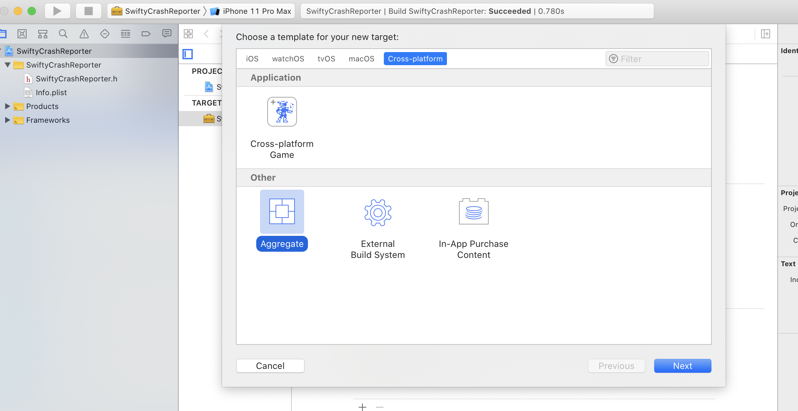
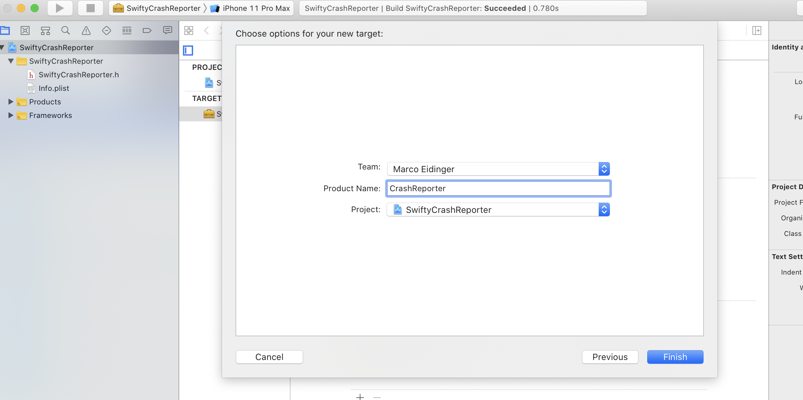
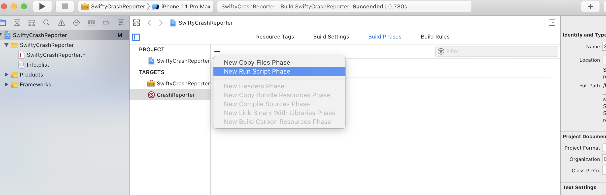
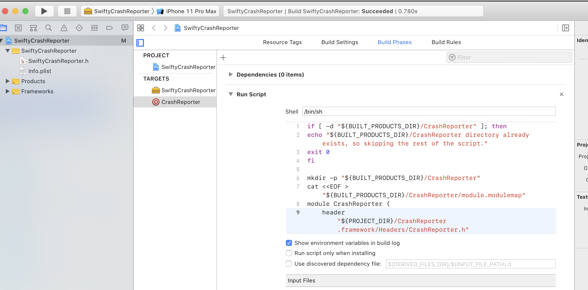
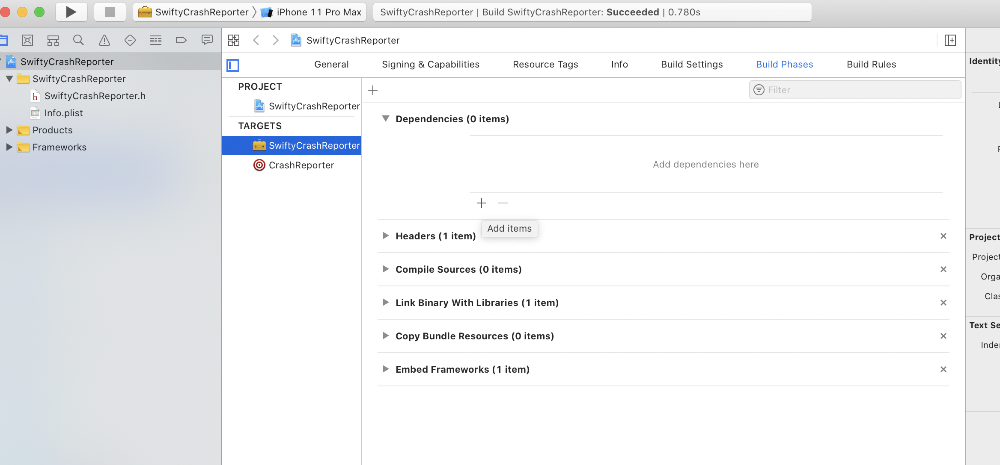
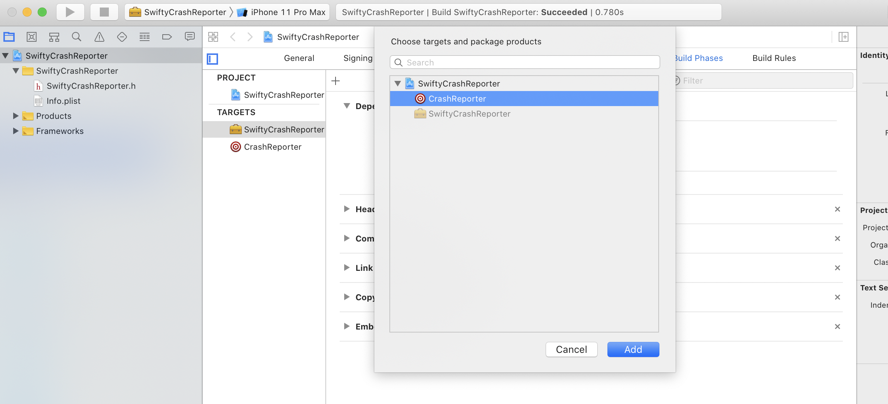
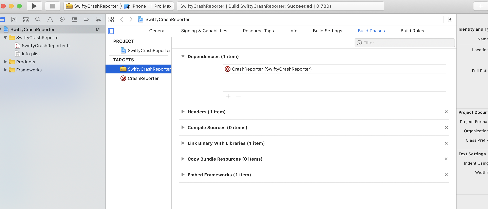
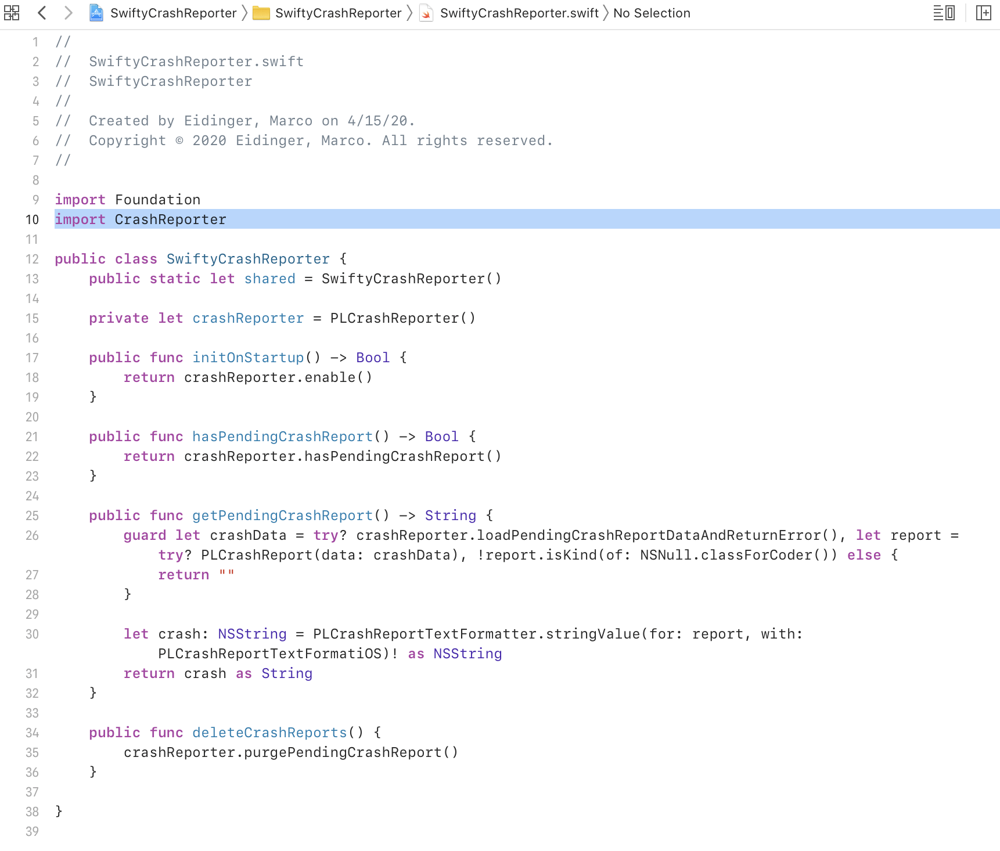
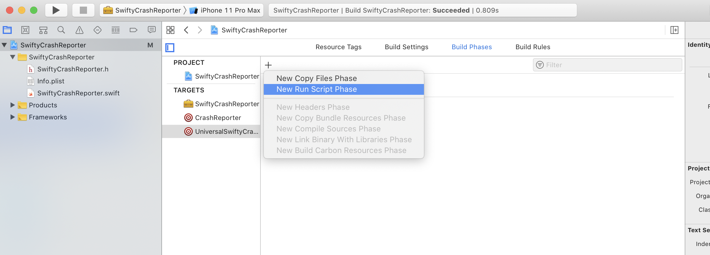
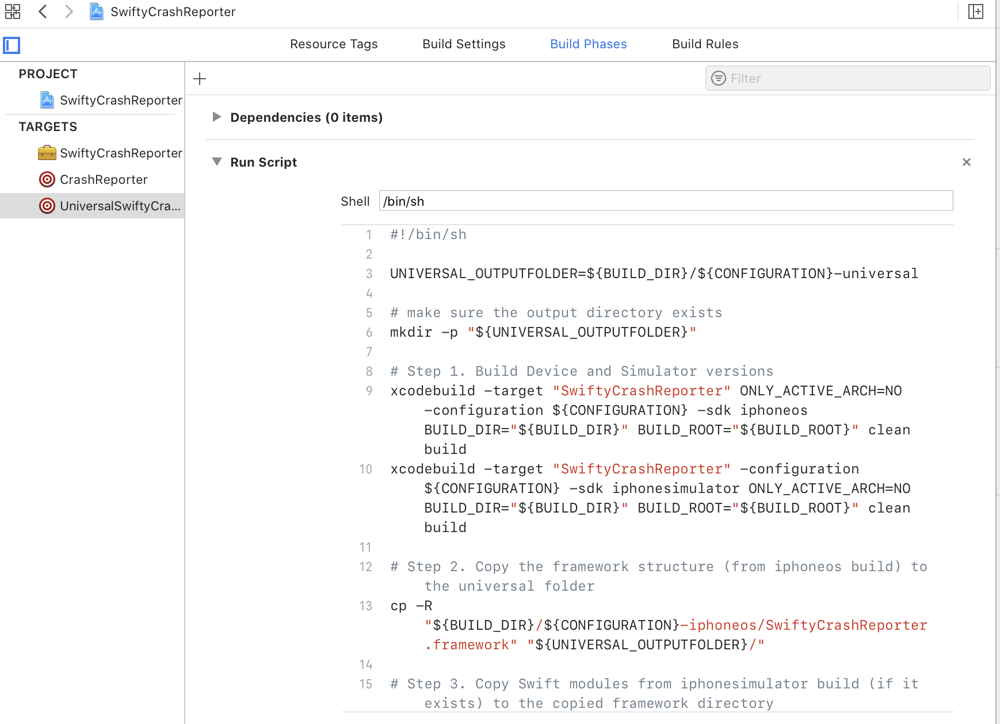

# obj-framework-in-swift-framework

## Motivation

This project demonstrates the use of an objective-c framework in a swift framework. Inspired by
- https://medium.com/@hello_73586/how-to-import-objective-c-framework-in-swift-framework-eeb731231099
- https://medium.com/captain-ios-experts/develop-a-swift-framework-1c7fdda27bf1

## Project Details

Repository content was created with Xcode 11.3.1 (11C504) / Swift 5.15

The objective framework to be used is `CrashReporter.framework` a.k.a as [PLCrashReporter](https://github.com/microsoft/plcrashreporter). Release version [1.5.1](https://github.com/microsoft/plcrashreporter/releases/download/1.5.1/PLCrashReporter-1.5.1.zip)

PLCrashReporter is a reliable open source library that provides an in-process live crash reporting framework for use on iOS, macOS and tvOS.

The project will use the iOS framework and provides the option to build a swift framework `SwiftyCrashReporter.framework`

`SwiftyCrashReporter.swift` acts as main API of the framework and wraps functionality of the underlying objective-c module.

## Project Steps

### Summary

1. Create `framework` project with Xcode
2. Add aggregate target to build module for objective-c framework
3. Specify aggregate target as dependency
4. Write swift code by importing module for objectivce-c framework
5. Add aggregate target to build swift framework

### Details about aggregate target to build module for objective-c framework






```bash
if [ -d "${BUILT_PRODUCTS_DIR}/CrashReporter" ]; then
echo "${BUILT_PRODUCTS_DIR}/CrashReporter directory already exists, so skipping the rest of the script."
exit 0
fi

mkdir -p "${BUILT_PRODUCTS_DIR}/CrashReporter"
cat <<EOF > "${BUILT_PRODUCTS_DIR}/CrashReporter/module.modulemap"
module CrashReporter {
    header "${PROJECT_DIR}/CrashReporter.framework/Headers/CrashReporter.h"
    export *
}
EOF
```

### Details about specifying aggregate target as dependency






### Example for importing module representing objectivce-c framework



### Details about aggregate target to build swift framework





```bash
#!/bin/sh

UNIVERSAL_OUTPUTFOLDER=${BUILD_DIR}/${CONFIGURATION}-universal

# make sure the output directory exists
mkdir -p "${UNIVERSAL_OUTPUTFOLDER}"

# Step 1. Build Device and Simulator versions
xcodebuild -target "SwiftyCrashReporter" ONLY_ACTIVE_ARCH=NO -configuration ${CONFIGURATION} -sdk iphoneos  BUILD_DIR="${BUILD_DIR}" BUILD_ROOT="${BUILD_ROOT}" clean build
xcodebuild -target "SwiftyCrashReporter" -configuration ${CONFIGURATION} -sdk iphonesimulator ONLY_ACTIVE_ARCH=NO BUILD_DIR="${BUILD_DIR}" BUILD_ROOT="${BUILD_ROOT}" clean build

# Step 2. Copy the framework structure (from iphoneos build) to the universal folder
cp -R "${BUILD_DIR}/${CONFIGURATION}-iphoneos/SwiftyCrashReporter.framework" "${UNIVERSAL_OUTPUTFOLDER}/"

# Step 3. Copy Swift modules from iphonesimulator build (if it exists) to the copied framework directory
SIMULATOR_SWIFT_MODULES_DIR="${BUILD_DIR}/${CONFIGURATION}-iphonesimulator/SwiftyCrashReporter.framework/Modules/SwiftyCrashReporter.swiftmodule/."
if [ -d "${SIMULATOR_SWIFT_MODULES_DIR}" ]; then
cp -R "${SIMULATOR_SWIFT_MODULES_DIR}" "${UNIVERSAL_OUTPUTFOLDER}/SwiftyCrashReporter.framework/Modules/SwiftyCrashReporter.swiftmodule"
fi

# Step 4. Create universal binary file using lipo and place the combined executable in the copied framework directory
lipo -create -output "${UNIVERSAL_OUTPUTFOLDER}/SwiftyCrashReporter.framework/SwiftyCrashReporter" "${BUILD_DIR}/${CONFIGURATION}-iphonesimulator/SwiftyCrashReporter.framework/SwiftyCrashReporter" "${BUILD_DIR}/${CONFIGURATION}-iphoneos/SwiftyCrashReporter.framework/SwiftyCrashReporter"

# Step 5. Convenience step to copy the framework to the project's directory
cp -R "${UNIVERSAL_OUTPUTFOLDER}/SwiftyCrashReporter.framework" "${PROJECT_DIR}"

# Step 6. Convenience step to open the project's directory in Finder
open "${PROJECT_DIR}"

```


